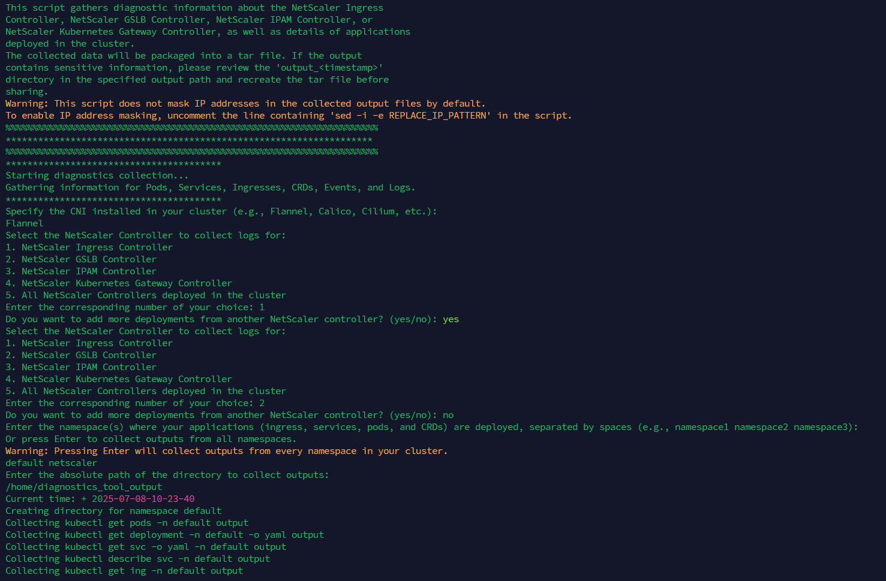

# Troubleshooting NetScaler Controller and Applications Deployed in a Kubernetes Cluster

This diagnostic tool is a shell script designed to collect information from NetScaler controllers namely the NetScaler Ingress Controller, NetScaler GSLB Controller, NetScaler IPAM Controller, and NetScaler Kubernetes Gateway Controller as well as from applications deployed in the cluster. Users can specify which NetScaler controller logs to collect or, choose to gather logs from all available controllers. Based on the input provided by the user, the appropriate NetScaler Controller is selected. 

This tool requires the following inputs: the CNI type and the namespace where applications are deployed. All collected diagnostic data is saved as a tar archive in the current working directory. Before sharing, users should review the `output_<timestamp>` directory created in the same location to ensure no sensitive information is included, and recreate the tar file if necessary.

## Usage Instructions

Download the script from [this repository](https://github.com/netscaler/modern-apps-toolkit):

```bash
cd modern-apps-toolkit/diagnostics_tool
./diagnostics_tool.sh
```

## Diagnostic Tool Overview

