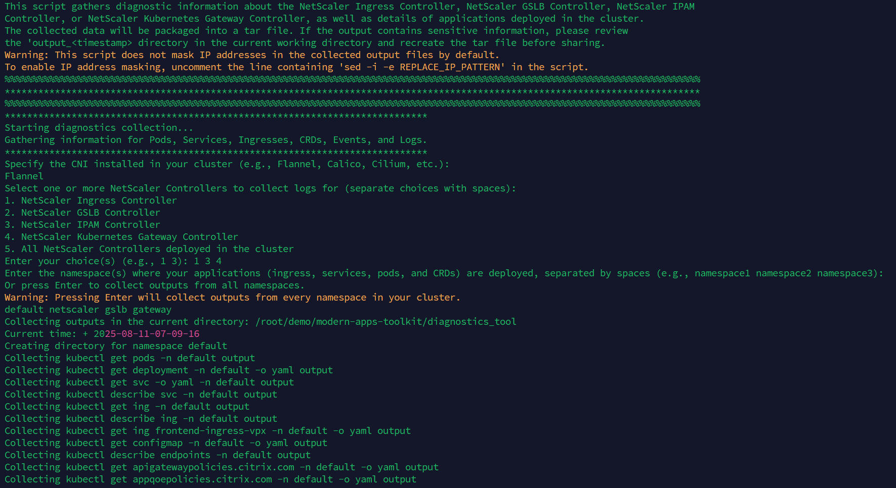

# Troubleshooting NetScaler Controller and Applications Deployed in a Kubernetes Cluster

This diagnostic tool is a shell script designed to gather information related to the NetScaler Ingress Controller, NetScaler GSLB Controller, or NetScaler Kubernetes Gateway Controller, as well as applications deployed within a Kubernetes cluster. Based on the input provided by the user, the appropriate NetScaler Controller is selected. 

This tool requires the namespace, CNI, and output directory path as inputs to extract the necessary information. The collected data is stored in a tar file format within the specified output directory. If any sensitive information is identified that should not be shared, users are advised to review the `output_<timestamp>` directory under the specified output directory path and recreate the tar file before sharing.

## Usage Instructions

Download the script from [this repository](https://github.com/netscaler/modern-apps-toolkit):

```bash
cd modern-apps-toolkit/diagnostics_tool
./diagnostics_tool.sh
```

## Diagnostic Tool Overview

