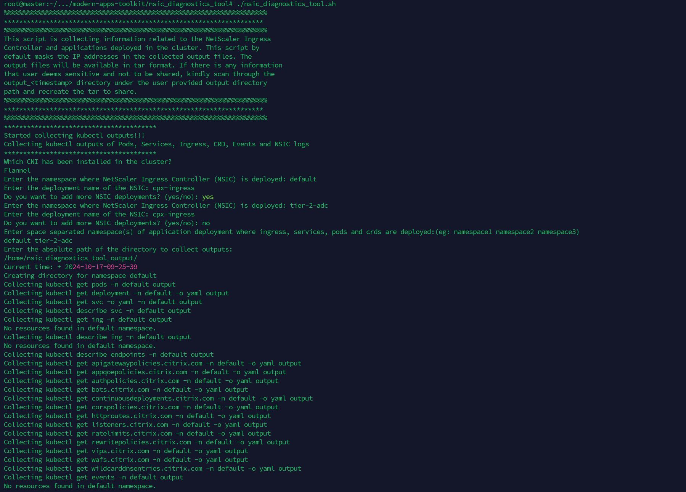

# Troubleshooting Netscaler Ingress Controller and application deployed in Kubernetes Cluster
NSIC Diagnostic tool is a simple shell script that collects information related to NetScaler Ingress 
Controller and applications deployed in the Kubernetes cluster. 
This tool takes namespace, CNI and output directory path as an input to extract
the necessary information and stores the output files  in tar format. 
If there is any information that user deems sensitive and not to be shared,
kindly scan through the output_<timestamp> directory under the user provided output directory 
path and recreate the tar to share.
## How to use this script
Download the script from [here](https://github.com/netscaler/modern-apps-toolkit) 
    
    cd modern-apps-toolkit/nsic_diagnostics_tool
    ./nsic_diagnostics_tool.sh

## Diagnostic Tool

